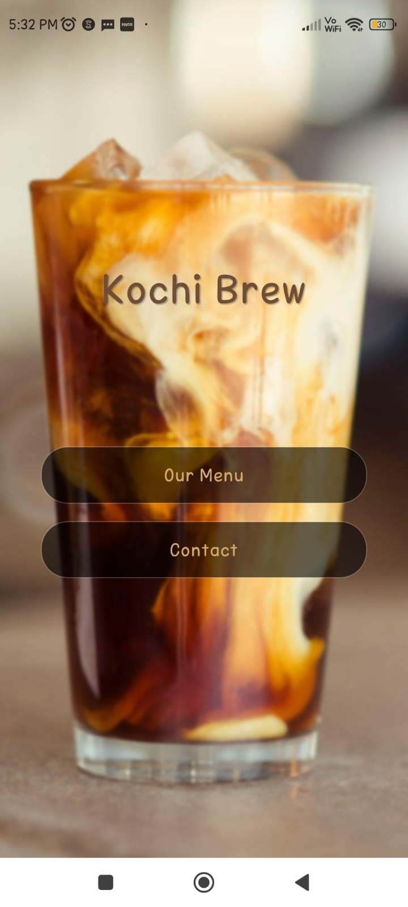
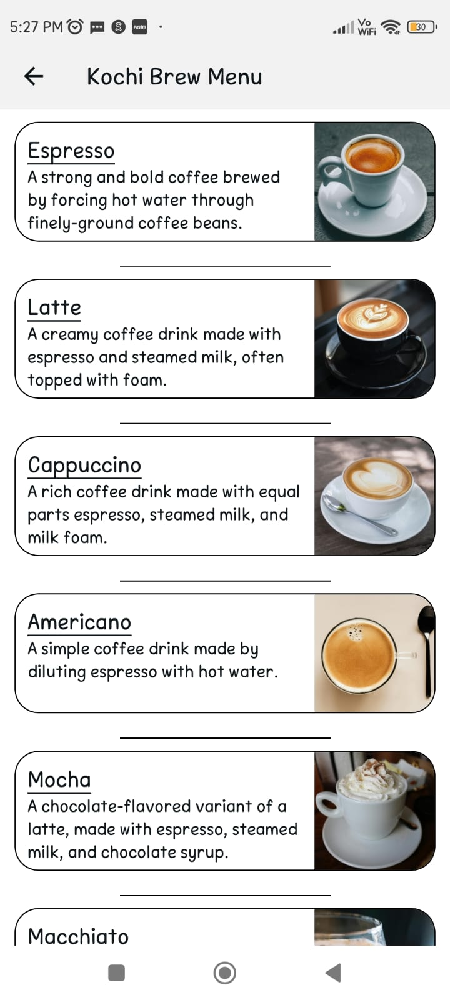
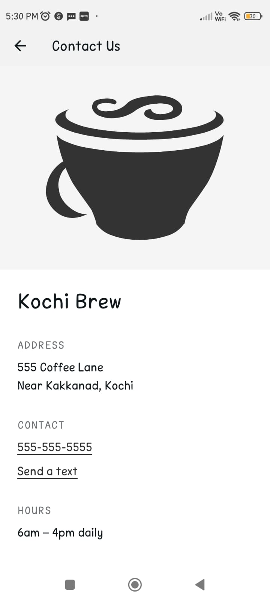

# Kochi Brew ☕️

Welcome to **Kochi Brew**, a React Native application built with [Expo](https://expo.dev) and [Expo Router](https://expo.dev/router). This app is designed to showcase a coffee shop's menu and contact information with a clean, modern UI. It supports light and dark themes, animations, and platform-specific optimizations.

---

## 📂 Project Structure

The project follows a modular structure for scalability and maintainability. Here's an overview of the key directories and files:

### Root Files
- **`app.json`**: Expo configuration file for app metadata, splash screen, and platform-specific settings.
- **`package.json`**: Contains dependencies, scripts, and project metadata.
- **`tsconfig.json`**: TypeScript configuration for strict type checking and path aliases.
- **`.gitignore`**: Specifies files and directories to ignore in version control.

### Key Directories
- **`app/`**: Contains all the screens for the app, leveraging file-based routing with Expo Router.
  - **`index.jsx`**: The home screen with a welcoming UI and navigation links.
  - **`menu.jsx`**: Displays the coffee shop's menu with images and descriptions.
  - **`contact.jsx`**: Provides contact details, address, and operating hours.
  - **`+not-found.tsx`**: A fallback screen for undefined routes.
- **`components/`**: Reusable UI components.
  - **`ThemedText.tsx`**: A text component that adapts to light and dark themes.
  - **`ThemedView.tsx`**: A view component with theme-aware background colors.
  - **`ParallaxScrollView.tsx`**: A scrollable view with a parallax header effect.
  - **`Collapsible.tsx`**: A collapsible section for expandable content.
  - **`HapticTab.tsx`**: Adds haptic feedback to tab interactions on iOS.
  - **`HelloWave.tsx`**: A fun animated waving emoji component.
  - **`ExternalLink.tsx`**: Opens links in an in-app browser or external browser.
- **`constants/`**: Stores static data and configurations.
  - **`Colors.ts`**: Defines light and dark theme colors.
  - **`MenuItems.js`**: Contains menu item data (title and description).
  - **`MenuImages.js`**: Maps menu items to their respective images.
- **`hooks/`**: Custom hooks for reusable logic.
  - **`useColorScheme.ts`**: Detects the current color scheme (light or dark).
  - **`useThemeColor.ts`**: Provides theme-aware colors for components.
- **`assets/`**: Contains fonts and images used in the app.
- **`scripts/`**: Utility scripts for project maintenance.
  - **`reset-project.js`**: Resets the project to a blank state.

---

## 🚀 Features

### 1. **File-Based Routing**
The app uses Expo Router for intuitive navigation. Each file in the `app/` directory corresponds to a route.

### 2. **Light and Dark Themes**
The app dynamically adapts to the system's color scheme using the `useColorScheme` hook.

### 3. **Reusable Components**
Components like `ThemedText`, `ThemedView`, and `ParallaxScrollView` ensure consistent styling and functionality across the app.

### 4. **Animations**
The app includes animations using `react-native-reanimated`, such as the parallax effect in `ParallaxScrollView` and the waving emoji in `HelloWave`.

### 5. **Platform-Specific Optimizations**
- iOS: Uses `BlurView` for a native-looking tab bar background.
- Android & Web: Falls back to Material Icons for consistent UI.

### 6. **Menu and Contact Screens**
- **Menu**: Displays a list of coffee items with images and descriptions.
- **Contact**: Provides the coffee shop's address, phone number, and operating hours.

---

## 🛠️ Setup and Installation

### Prerequisites
- Node.js (v16 or higher)
- Expo CLI (`npm install -g expo-cli`)

### Steps
1. Clone the repository:
   ```bash
   git clone https://github.com/Alwinkg7/CoffeeMenuApp.git
   cd MyApp
   ```

2. Install dependencies:
   ```bash
   npm install
   ```

3. Start the development server:
   ```bash
   npx expo start
   ```

4. Open the app:
   - Scan the QR code with the Expo Go app on your device.
   - Or, use an emulator/simulator for Android or iOS.

---

## 🧪 Testing

The project uses Jest for testing. Run the following command to execute tests:

```bash
npm run test
```

Snapshot tests are included for components like `ThemedText`.

---

## 📜 Scripts

- **`npm start`**: Start the development server.
- **`npm run android`**: Launch the app on an Android emulator.
- **`npm run ios`**: Launch the app on an iOS simulator.
- **`npm run web`**: Launch the app in a web browser.
- **`npm run reset-project`**: Reset the project to a blank state.
- **`npm run lint`**: Run linting checks.

---

## 📚 Learn More

- [Expo Documentation](https://docs.expo.dev/)
- [React Native Documentation](https://reactnative.dev/)
- [Expo Router Documentation](https://expo.dev/router)

---

## 🖼️ Screenshots

### Home Screen


### Menu Screen


### Contact Screen


---

## 🤝 Contributing

Contributions are welcome! Feel free to open issues or submit pull requests.

---

## 📄 License

This project is licensed under the MIT License. See the `LICENSE` file for details.